Preparación del entorno: Instalación y configuración de la red. 

a) Instala y configura las máquinas indicadas en la topología de red, asignando manualmente 
las direcciones IP indicadas a los dispositivos correspondientes. Cambia los nombres de los 
equipos según se indica en el diagrama. 

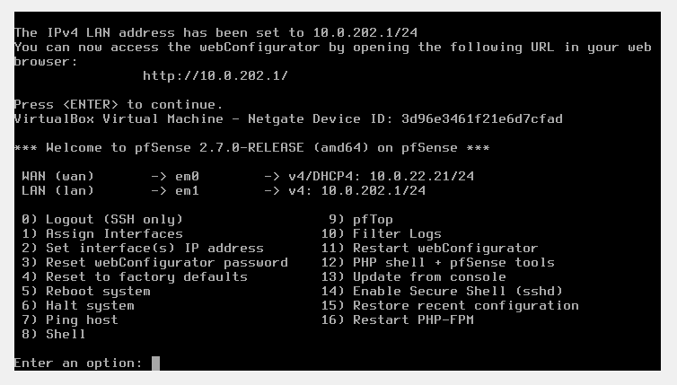

Preparamos el PfSense con nuestra IP.

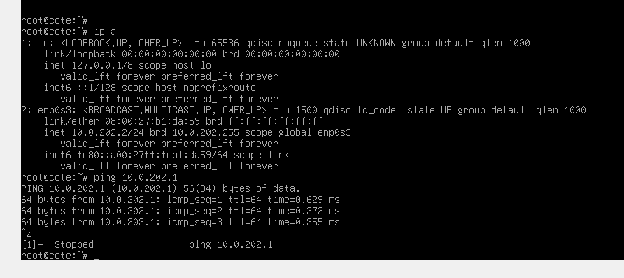

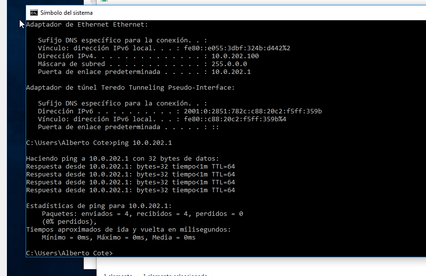

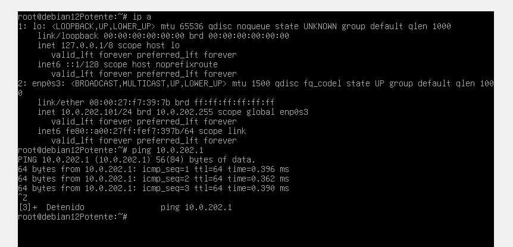
Configuramos los parámetros de red de las 3 máquinas y hacemos ping para comprobar.

b) Realiza los ajustes necesarios en el router pfSense para que funcione correctamente. NOTA: 
Recuerda desactivar el servidor DHCP en la interfaz interna SRIXX.

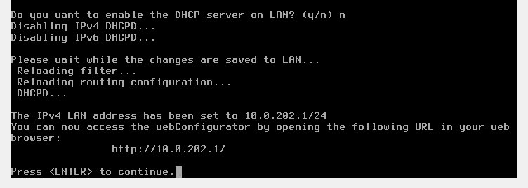

c) Comprueba que la máquina Debian navega por Internet. 
HASTA QUE LA RED NO ESTÉ BIEN CONFIGURADA Y TODOS LOS EQUIPOS CON 
CONEXIÓN A INTERNET, NO DEBES COMENZAR A CONFIGURAR EL SERVICIO 
DHCP.

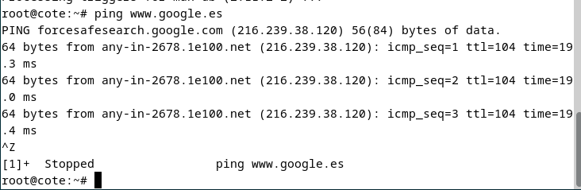

Ejercicio 1. Configuración del servidor DHCP. 

a) Instala el servidor DHCP en la máquina correspondiente. 

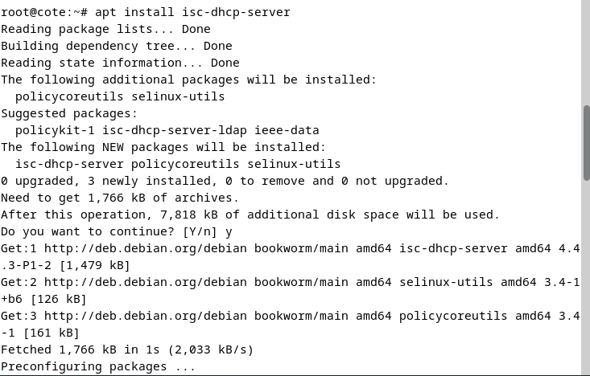

b) Realiza las configuraciones adicionales necesarias para que funcione el servidor DHCP. 

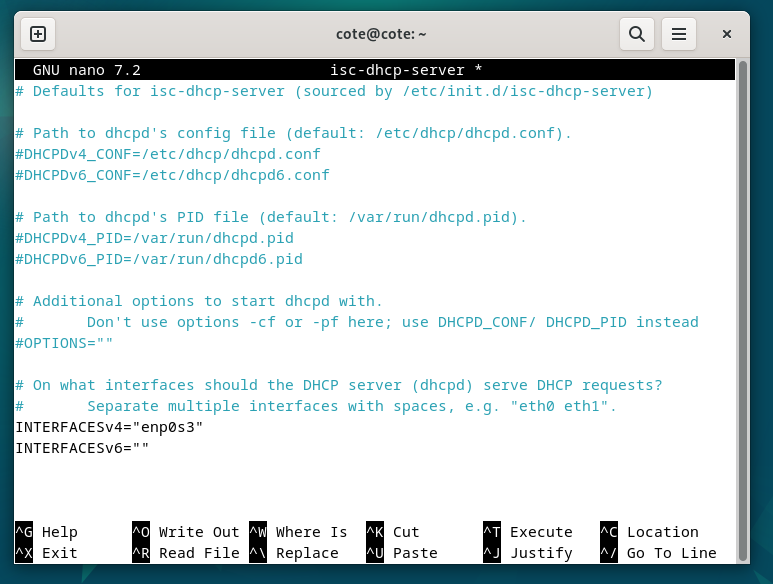

c) Realiza las configuraciones necesarias para cumplir los siguientes requisitos: 
a. El servidor repartirá direcciones IP en el rango 10.0.XX.1 – 10.0.XX.100. 

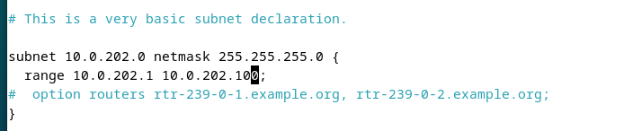

b. Utilizará la máscara por defecto correspondiente a esa subred. 

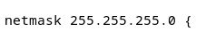

c. Deberá utilizar como puerta de enlace la que corresponda según el 
diagrama de red. 

d. Como servidor DNS preferido se utilizará el del instituto (deberás 
averiguarlo) y como alternativo el de google. 

e. Además, se enviará a los clientes el sufijo DNS sriXX.local. 

f. Para el cliente Ubuntu se le reservará la dirección 10.0.XX.60.

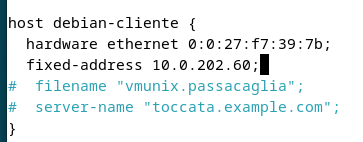

g. Respecto a los tiempos de alquiler: 
i. El tiempo de alquiler por defecto será de 15 días para todos los 
equipos. 
ii. Nunca será superior a 30 días. 
iii. Nunca será inferior a 1 semana. 

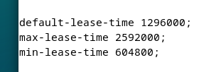
Configuro las 3 cosas en orden.

d) Reinicia el servicio y verifica que tras el reinicio está activo y en ejecución. 

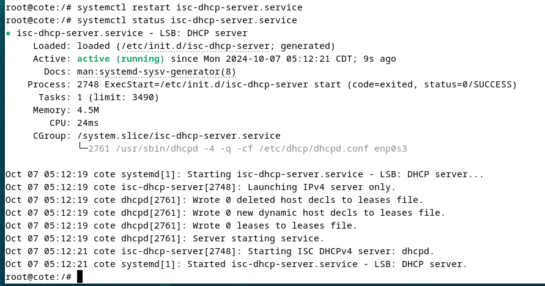

Ejercicio 2. Configuración de los clientes DHCP. 
a) Configura los equipos Windows y Linux como clientes DHCP. 

b) Observa dentro del archivo adecuado del servidor si las IPs han sido asignadas. 
c) Observa dentro de ambos clientes que son correctos todos los parámetros enviados por el 
servidor, es decir: 
i. IP 
ii. Máscara 
iii. Puerta de enlace 
iv. DNS primario 
v. DNS alternativo 
vi. Nombre de dominio 
vii. La MAC del equipo que tiene la reserva. 
d) Verifica que existe conectividad entre los equipos y que además ambos equipos se conectan 
a Internet. 
SERVICIOS DE RED E INTERNET - CFGS ASIR 
Unidad 1: Servicio de configuración automática de red
UT1-Prática2 Página 5 
Ejercicio 3. Funcionamiento del servicio. 

Para terminar, deberás explicar la actividad generada por el servidor isc-dhcp-server que has 
instalado y configurado y que se ha registrado en los logs del sistema por la herramienta 
Journalctl. 
AYUDA: Aplica el tipo de filtro adecuado para que solo se muestre la actividad concreta relativa 
a la asignación de la configuración de tu cliente en un determinado intervalo de tiempo. 
