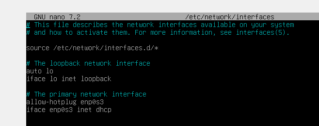
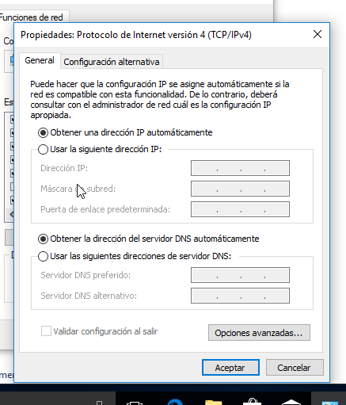
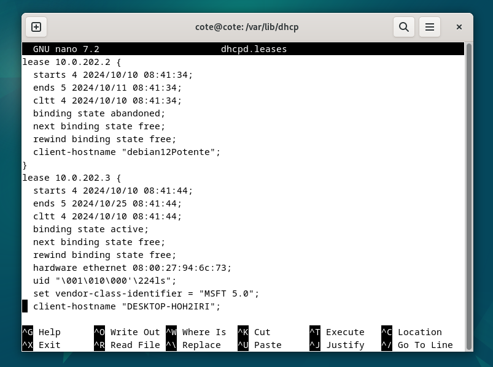
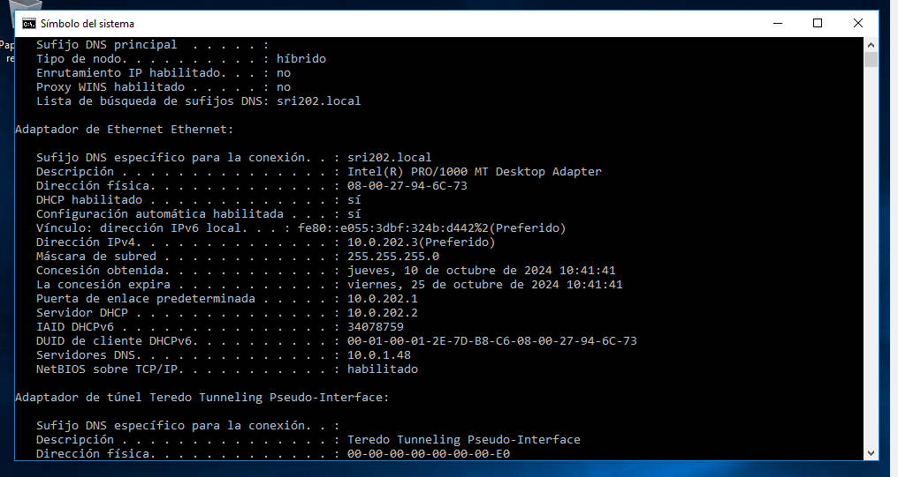
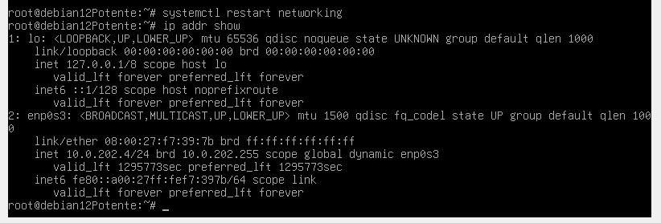
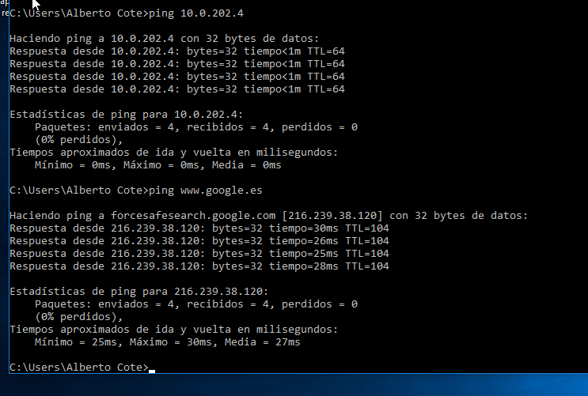
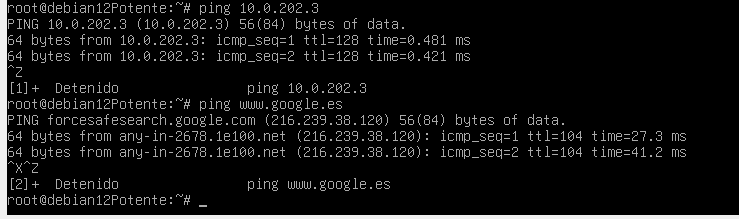
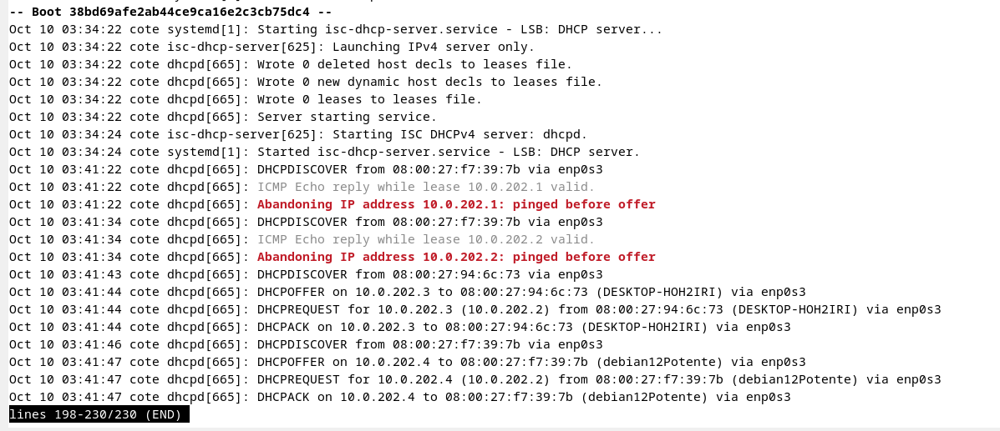

Preparación del entorno: Instalación y configuración de la red. 

Instalamos y configuramos las máquinas indicadas en la topología de red, asignando manualmente 
las direcciones IP indicadas a los dispositivos correspondientes.

Preparamos el PfSense con nuestra IP.

Configuramos los parámetros de red de las 3 máquinas y hacemos ping para comprobar.

Realizamos los ajustes necesarios en el router pfSense para que funcione correctamente. 
Desactivamos el servidor DHCP en la interfaz interna.

Comprobamos que la máquina Debian navega por Internet.

Configuración del servidor DHCP. 

Instalamos el servidor DHCP en la máquina correspondiente. 

Realizamos las configuraciones adicionales necesarias para que funcione el servidor DHCP. 

Realizo las configuraciones necesarias para cumplir los siguientes requisitos: 
a. El servidor repartirá direcciones IP en el rango 10.0.XX.1 – 10.0.XX.100. 

b. Utilizará la máscara por defecto correspondiente a esa subred. 

c. Deberá utilizar como puerta de enlace la que corresponda según el 
diagrama de red. 

d. Como servidor DNS preferido se utilizará el del instituto (deberás 
averiguarlo) y como alternativo el de google. 

e. Además, se enviará a los clientes el sufijo DNS sriXX.local. 

f. Para el cliente Ubuntu se le reservará la dirección 10.0.XX.60.

g. Respecto a los tiempos de alquiler: 
i. El tiempo de alquiler por defecto será de 15 días para todos los 
equipos. 
ii. Nunca será superior a 30 días. 
iii. Nunca será inferior a 1 semana. 

Configuro las 3 cosas en orden:

Reinicio el servicio y verifico que tras el reinicio está activo y en ejecución. 

Configuración de los clientes DHCP. 
Configuramos los equipos Windows y Linux como clientes DHCP. 

Observamos dentro del archivo adecuado del servidor si las IPs han sido asignadas. 

Observamos dentro de ambos clientes que son correctos todos los parámetros enviados por el 
servidor, es decir: 
i. IP 
ii. Máscara 
iii. Puerta de enlace 
iv. DNS primario 
v. DNS alternativo 
vi. Nombre de dominio 
vii. La MAC del equipo que tiene la reserva. 

Verifico que existe conectividad entre los equipos y que además ambos equipos se conectan 
a Internet. 

Funcionamiento del servicio. 

Para terminar, explico la actividad generada por el servidor isc-dhcp-server que he 
instalado y configurado y que se ha registrado en los logs del sistema por la herramienta 
Journalctl.

